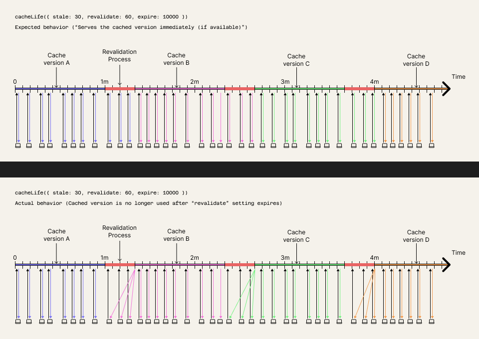

### Short description

On each reload, you should receive a response almost instantly, but after the revalidate period expires, you will see a long loading time (`sleep("10s")` in `CachedPart`)

### Details

For `CachedPart`, `cacheLife({ stale: 5, revalidate: 25, expire: 10000 })` is set;

According to the [documentation](https://nextjs.org/docs/app/api-reference/functions/cacheLife#revalidate), with this configuration, background revalidation should run every 25 seconds, and while it's revalidating on-background users will continue to receive the old content

Above the content, `cookies()` is used, from which the `test` key is obtained and passed as a prop to `CachedPart`

The component works correctly until revalidation completes, recognizing that the prop hasn't changed - it immediately serves content from the cache

After the revalidation period expires (with the same cookies still present, i.e., the `test` prop) - the component ignores the still-existing cache and the user waits for its update

**Note**: _With the same configuration, but without using the dynamic API (`cookies()`) on the page - everything works correctly_

### Visual details:

### Why this is a bug:

https://nextjs.org/docs/app/api-reference/functions/cacheLife#revalidate

> ### revalidate
>
> How often the server regenerates cached content in the background.
>
> When a request arrives after this period, the server:
>
> - Serves the cached version immediately (if available)
> - Regenerates content in the background
> - Updates the cache with fresh content
> - Similar to Incremental Static Regeneration (ISR)

### Summary

Expected behavior: Same as without Dynamic API - the user always receives content immediately, and updates happen in the background

Actual behavior: After the revalidate period expires, you will see a long loading time for 10 seconds and only then the content
